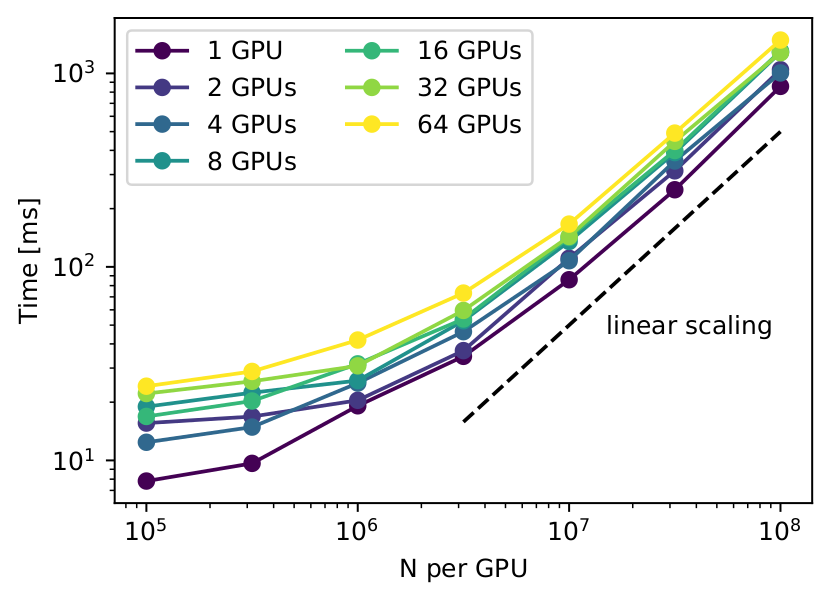

# jz-fmm

**jz-fmm** (*JAX z-order tree, Fast Multipole Method*) provides fast, GPU-native force calculations and differentiable gravitational N-body simulations in JAX, with a performance-critical CUDA backend. It builds on [jz-tree](https://jstuecker.github.io/jztree/) for tree construction, traversal, and distributed communication.

It includes:

- Fast multipole force evaluation on single and multiple GPUs.
- Time integration and external potential contributions.
- Differentiation through force calculations and simulations with JAX.

**[Documentation](https://jstuecker.github.io/jzfmm/)** · [Installation](https://jstuecker.github.io/jzfmm/installation.html) · [Getting started](https://jstuecker.github.io/jzfmm/quickstart.html) · [Attribution](https://jstuecker.github.io/jzfmm/attribution.html)

## Multi-GPU scaling

Performance across particle counts and one to 64 GPUs. In the GPU-saturating regime, efficiency decreases by less than a factor of two from one to 64 devices. See the [documentation](https://jstuecker.github.io/jzfmm/) for benchmark details and force-accuracy comparisons.

## Attribution

**jz-fmm** was written by Jens Stücker and is available under the MIT license. If you publish work using **jz-fmm**, please cite the accompanying paper once its citation information is available. See the [attribution page](https://jstuecker.github.io/jzfmm/attribution.html) for funding and acknowledgement details.
