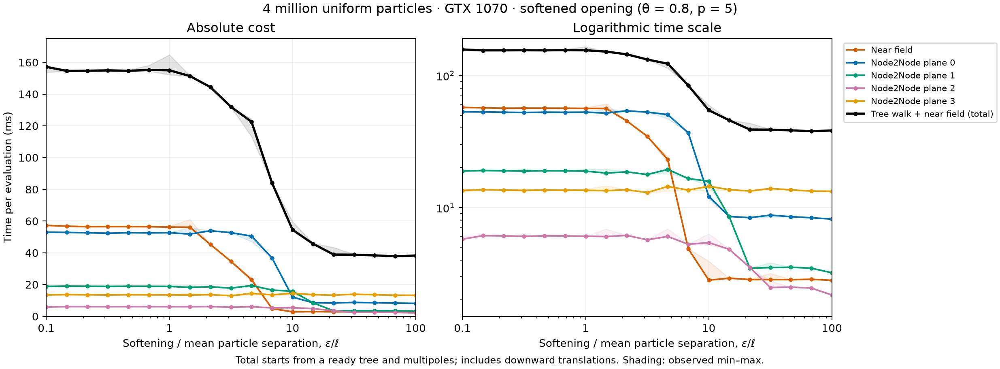

# Evaluation time versus softening



19 logarithmically spaced values of epsilon/l from 0.1 to 100, where
l = N^(-1/3) = 0.006299605249474368 for the unit cube. Same 4-million-particle
uniform float32 distribution, seed 0, equal masses, and default tree as before.
The Plummer kernel and softened opening criterion both use the swept epsilon;
theta = 0.8, expansion order p = 5. GTX 1070, 8 GiB; CUDA12 backend from the
preceding softened-opening experiment. All 19 cases use the same prebuilt tree
and multipoles. Execution order was randomized with seed 42 and recorded.

## What is timed

The black curve is **synchronized wall time for the dual tree walk plus near
field**, including initial walk setup, local-to-local shifts and final
local-to-particle translation. It excludes sorting, tree construction,
multipole construction and restoring original particle order. It is therefore
smaller than the full or existing-tree timings in the earlier reports.

The colored curves are GPU timings for leaf-leaf and individual Node2Node
planes. Each plane includes its M2L/count kernel, count initialization,
insertion and intervening list/staging work. Downward-translation kernels
and their initialization are excluded from plane totals but included in the
black total. Compiler-scheduled staging operations can occur within a plane's
count-to-insert interval; the definition is based on actual execution order.
The black curve also includes CPU dispatch/synchronization and other GPU work,
so it is not simply the sum of the colored curves.

Each point uses four warmup calls, 30 unprofiled synchronized samples, and
10 additional CUDA-profiled calls for the components. Medians are plotted;
shading is the observed min/max, not a confidence interval. Inputs are already
on the GPU; compilation and data generation/transfers are excluded. Clocks
were unlocked and the desktop active. Small wiggles include run variability.

## Results

| epsilon/l | Near field (ms) | Plane 0 | Plane 1 | Plane 2 | Plane 3 | Total walk + near (ms) |
|---:|---:|---:|---:|---:|---:|---:|
| 0.1 | 57.27 | 52.99 | 18.87 | 5.75 | 13.45 | 157.15 |
| 1 | 56.23 | 52.67 | 18.84 | 6.06 | 13.50 | 155.01 |
| 3.16 | 34.59 | 52.70 | 17.75 | 5.69 | 12.97 | 131.98 |
| 10 | 2.82 | 12.09 | 15.79 | 5.42 | 14.49 | 54.47 |
| 21.5 | 2.85 | 8.37 | 3.47 | 3.51 | 13.32 | 38.91 |
| 100 | 2.81 | 8.17 | 3.20 | 2.17 | 13.24 | 38.26 |

Total time drops mainly across epsilon/l ≈ 2–20, reaching about 38 ms for
large epsilon (about 4.1× faster than the small-epsilon total). Leaf-leaf time
reaches a roughly 2.8 ms floor by epsilon/l ≈ 10. Plane 0 drops strongly around
5–10, followed by plane 1 and plane 2. Plane 3 remains around 13–14 ms and is
the largest individual interaction component at large softening. Timings alone
do not separate residual traversal, padded-buffer work and accepted arithmetic.

## Validation and accounting correction

All outputs were finite. The isolated walk-plus-near-field pipeline gave
bit-identical outputs to the normal existing-tree force evaluator at epsilon/l
= 0.1, 3.16227766 and 100. This verifies the timing pipeline, not the accuracy
of the softened approximation against direct forces over this sweep. The
preceding epsilon/l = 3 experiment contains a sampled direct-force comparison.

The trace parser checks one serial compute stream, exactly four ordered
M2L/insert pairs and one leaf-leaf kernel per evaluation, disjoint plane event
sets, and nonnegative residual GPU time. While analyzing this sweep, a flaw
in the previous grouping was found: walking backward through a shared CUDA
graph HLO label could include extra setup/translation work and, in some traces,
double-count events. The parser now includes only the immediately preceding
count-array memset, and excludes downward translations and their memsets from
plane intervals. Every saved sweep trace was reprocessed with this correction.
This also refines the earlier reports' component definitions; their near-field
and independently measured total times are unaffected. See their appended
accounting notes for corrected historical plane values.

The parser correction changes analysis only; no GPU rerun is needed to correct
saved traces. Component timings come from profiled runs, so they can be slightly
higher than their contribution to an unprofiled total.

## Reproduction and files

Use the rebuilt softened-opening extension documented in
[the build notes](../softened-uniform-4m-gtx1070/BUILD.md), then from the repo root:

```bash
python checks/profiling/sweep_softening.py --output /tmp/epsilon-sweep
python checks/profiling/plot_softening_sweep.py /tmp/epsilon-sweep /tmp/epsilon-plots
```

`results.csv` summarizes the sweep; `point_*/` retains all wall-clock samples,
GPU trace summaries, per-call component times and individual M2L/insert times.
`sweep.json` records the epsilon grid, execution order and total definition.
PNG and PDF are standalone exports. Original CUPTI traces remain locally in
`/home/bender/Work/benchmarks/jzfmm-epsilon-sweep-2026-09-12`.
