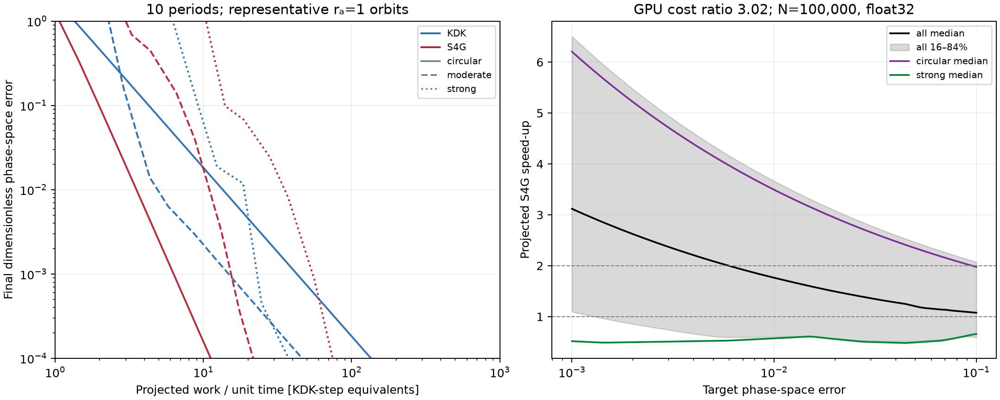
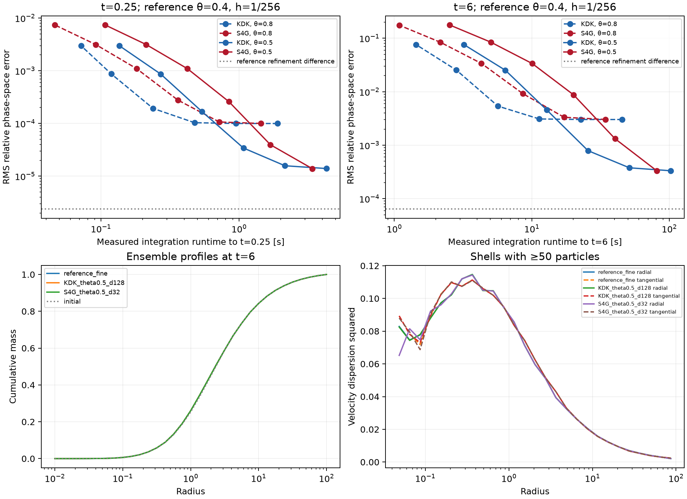

# Fourth-order force-gradient evaluation

Evaluation on the local GTX 1070 (8 GiB), branch `symplectic_o4`, based on
`47ec34b0d71d3a45cc8913790f84358108308628`. The experimental code is confined
to this directory; production configuration and integrator dispatch are unchanged.

**Conclusion: deprioritize S4G as a general fixed-global-step replacement for
collisionless Hernquist haloes on this GPU.** The implementation passes
fourth-order validation, but the measured step cost is 3.0–3.3× KDK. Ideal
analytic orbits project median gains of 1.76× at 1% error and 3.12× at 0.1%,
with the strongest pericentric subset slower than KDK. In the self-consistent
halo, every bracketed target comfortably above reference uncertainty gives
only **0.50–0.63× speed-up**: S4G is **1.6–2.0× slower** at matched trajectory
accuracy. There is no demonstrated 2× practical gain to justify optimization
or production integration. High-precision, nearly circular applications remain
a possible niche, not a demonstrated general halo benefit.

## Implementation and validation

`integrators.py` implements `K(h/6) D(h/2) K̃(2h/3) D(h/2) K(h/6)` with
`ã = a + h² J_aᵀ a / 24`. `jax.vjp` returns the primal acceleration and its
pullback together, allowing the central kick to reuse the primal tape.
Only positions are differentiated. All N-body experiments use equal masses.
For an exact conservative equal-mass force, `J_aᵀ a = J_a a`; this must not
be assumed for arbitrary approximate forces or unequal masses. The experimental
helper does not support time-dependent/external fields.

The stage coefficients and correction follow
[FROST, equations 21–28](https://academic.oup.com/mnras/article/502/4/5546/6081060).
The scalar correction is the position gradient of `|a|²/2` for equal masses.
Both methods retain the final ordinary acceleration for the next step.
GPU KDK calls the existing `jzfmm.time_integration.timestep`; S4G uses the same
`force_and_potential` endpoint evaluation. The analytic CPU benchmark uses the
corresponding KDK algebra with the analytic acceleration.

The independent Hernquist contraction is `J_a a = -2 x / [r (1+r)^5]`.
Random-point float64 autodiff and finite-difference checks are saved in
[validation.json](results/validation.json). A separate GPU check compares the
VJP against an explicit softened pair-sum contraction, including source **and**
target motion. It agrees to `4.1e-16` relative error. On a 512-particle validation
snapshot at θ=0.8, FMM/direct relative differences are `3.87e-4` for acceleration
and `3.15e-5` for the contraction. Finite differences across changing interaction
lists are not smooth; with perturbations of `1e-6`–`1e-8` along the acceleration,
the FMM directional derivative and VJP agree to about `3.4e-7` relative error.
This is a small-snapshot check, not proof of globally smooth/symplectic FMM forces.

Analytic convergence fits use the last four resolved points satisfying
`1e-10 < e_phase < 1e-3`. Across the 15 orbits the fitted orders are
1.99990–2.00017 for KDK and 3.97550–4.00298 for S4G. One-period forward/backward
errors at `h=T/4096` are at most `1.3e-14` and `1.5e-14`, respectively.
The very eccentric cases enter fourth-order scaling only after their
pericentres are adequately resolved; coarse-step superconvergence is not used
as evidence of order. Both methods converge to the DOP853 trajectory.
The complete GPU steps also pass an independent softened eccentric binary
test: fitted orders 1.9972 and 3.9995, with reversibility errors ≤1.1e-14;
see [binary_validation.json](results/binary_validation.json).

## Analytic accuracy and projected work

The suite includes six circular radii `{0.05,0.1,0.3,1,3,10}` and nine eccentric
orbits with apocentres `{0.1,1,10}` and pericentre ratios `{0.5,0.2,0.05}`.
Turning-point energy equality sets eccentric angular momenta. Circular periods
are `2πr/v_c`; eccentric radial periods come from turning-point quadrature.
Each integration ends at exactly ten of its own periods, shared between methods.
The fixed steps scan `T/{4,6,8,…,32768}`.

`e_phase² = |Δx|²/r_a² + |Δv|²/v_c(r_a)²`, where
`v_c(r_a)=sqrt(r_a)/(1+r_a)` and `G=M=a=1`. The reference uses DOP853 with
relative tolerances `2e-11` and `2.3e-14`, and absolute tolerance
`0.01*rtol*min(r_p,v_t,1)`. The tighter solution is used. The largest final
phase-space difference on tightening is `9.2e-9`, well below the target range.
Dense unwrapped reference azimuth is checked with 65,537 and 131,073 samples.

Raw rows also contain maximum/final relative energy error, maximum relative
angular momentum error, radius extrema, and unwrapped azimuthal phase error.
Maximum errors and extrema are sampled at step endpoints; pericentre estimates
therefore include sampling error. Azimuthal unwrapping is reliable only when
resolved (a coarse step can cross more than π). Neither energy nor azimuth alone
sets the decision metric.

For each target we log-interpolate the largest acceptable step. Starting from
the smallest step, a cumulative maximum error envelope rejects isolated
coarse-step error dips. No extrapolation beyond the measured scan is allowed.
Projected speed-up is `(h4/h2)/R_cost`. Orbit quantiles weight each orbit equally;
they are not a halo population weighting or confidence interval.

The left panel shows the three representative `r_a=1` orbits (circular,
`r_p/r_a=0.2`, and `0.05`) to keep method pairs readable; the right panel
uses all 15 orbits. All curves are available numerically in the raw scan.



[PDF](results/decision.pdf) · [Raw orbit scan](results/analytic.csv) ·
[Interpolated steps and speed-ups](results/speedups.csv)

| Target trajectory error | Median projected speed-up | 16–84% across orbits | Orbits above 2× |
|---|---:|---:|---:|
| 0.1 | 1.08× | 0.59–2.07× | 3/15 |
| 0.03 | 1.36× | 0.52–2.79× | 5/15 |
| 0.01 | 1.76× | 0.60–3.66× | 7/15 |
| 0.003 | 2.37× | 0.74–4.95× | 9/15 |
| 0.001 | 3.12× | 1.10–6.51× | 10/15 |

The strongly pericentric subset has median speed-up below one throughout this
target range. Circular orbits drive much of the favorable projection.


## Actual GPU cost

Timing snapshots are equal-mass Hernquist spatial samples truncated at `r=100a`
(98.03% of the untruncated enclosed mass), renormalized to total mass one.
Their representative velocities are for cost measurement only. Seed 20260913,
Plummer softening `0.01a`, order `p=5`, θ=0.8, default leaf size 32,
`alloc_fac_nodes=8`, `alloc_fac_ilist=256`. Larger allocation factors prevent
Hernquist tree/list overflow; they are identical between methods.
These are explicit representative choices, not calibrated cosmological settings.

Each operation is compiled once, warmed three times, then timed for 21 repeats
with `jax.block_until_ready` before and after the call. Raw samples, 16th/84th
percentiles and first-call times are saved. “Contraction” supplies cached `a`
as cotangent but rebuilds the primal tape; “combined” returns both `a` and
`J_aᵀa` from one VJP. No stored tape at frozen positions is substituted for an
actual moving-particle central kick. Full eight-step batches evolve positions,
rebuild trees, and reuse endpoint forces. Their median wall-time ratio sets
`R_cost`; no nominal force-count estimate is used. First-call/JIT and transfers
are excluded. The desktop stays active; clocks are not locked. The final GPU
cost measurements run serially without simultaneous N-body workloads.

| N / precision | Acceleration | Contraction (cached a) | Combined central | KDK step | S4G step | Eight-step cost ratio |
|---|---:|---:|---:|---:|---:|---:|
| 100,000 / float32 | 16.26 ms | 27.72 ms | 29.84 ms | 14.81 ms | 44.56 ms | 3.024× |
| 1,000,000 / float32 | 89.22 ms | 173.55 ms | 189.29 ms | 90.66 ms | 282.53 ms | 3.129× |
| 100,000 / float64 | 180.18 ms | 178.01 ms | 202.76 ms | 86.99 ms | 289.91 ms | 3.338× |

Single-step costs and eight-step ratios are independently measured. Full batch
timings are the decision input; compiler differences mean standalone force
costs need not add exactly to integrator costs. For the 100k float32 eight-step
batches, the observed 16–84% time ranges are 116.61–116.77 ms (KDK) and
352.80–353.15 ms (S4G). At one million they are 731.54–731.95 ms and
2271.06–2290.40 ms. These are repeat variation, not confidence intervals.


[Environment versions](results/environment.json). CUDA backend comes from the
installed `jzfmm 1.0.1` wheel; Python force/integrator code comes from this
checkout through `PYTHONPATH=src`. No CUDA kernel optimization was attempted.

## Self-consistent N-body follow-up

The tighter analytic targets exceed the 2× median threshold, so Phase D runs.
N=100,000, equal masses, float32, the same Plummer softening and expansion order,
θ={0.8,0.5}, and `alloc_fac_ilist=1024` for all Phase D runs (the tighter
reference exceeds the Phase B list capacity). Initial velocities are rejection samples from the isotropic
[Hernquist distribution function, equation 17](https://adsabs.harvard.edu/pdf/1990ApJ...356..359H).
The finite realization is truncated at 100a and its mean position/velocity
removed. This standard unsoftened DF is **near equilibrium**, not an exact
equilibrium of the softened/truncated system; all runs share its initial
readjustment. An exactly softened equilibrium was not constructed.

KDK steps are `{1/16,1/32,1/64,1/128,1/256,1/512}` and S4G steps are
`{1/4,1/8,1/16,1/32,1/64,1/128}`. Coarse points are included to bracket
practical error targets, even when they poorly resolve the central cusp. Runs end at `t=6`, three scale-radius dynamical times
using `t_dyn(a)=sqrt(a³/[GM(<a)])=2`. Outputs at `{0.25,1,2,4,6}` include a
short-time particle comparison and longer-time ensemble metrics. The reference
uses θ=0.4 and S4G `h=1/256`, checked against `h=1/128` over the full duration.
N-body particle errors use fixed global scales `r_scale=1`, `v_scale=0.5`, and
report RMS, median, 90th and 99th percentiles; they differ deliberately from the
per-orbit scaling of Phase A. A supplementary error uses each particle’s
initial `r_scale=max(|x0|,0.05)` and `v_scale=sqrt(r_scale)/(1+r_scale)`.
This records relative orbit error without letting absolute drift rounding in
the distant float32 halo dominate the statistic. The global metric is retained.
Targets less than ten times the reference-refinement difference are marked
unresolved in the matched-speed-up data. The initial-condition normalization and softened
potential are common to all methods.

`comparison.csv` reports cumulative-mass differences, energy changes, angular
momentum and COM drift. Each run's JSON contains shell counts, radial/tangential
velocity dispersion profiles and all integration-block times. Timing includes
GPU computation and host callbacks for complete trajectories, excluding JIT,
snapshot serialization and diagnostics. Energy uses each run's own softened FMM
potential, so its force approximation also affects the reported energy error.
The fine-reference comparison contains both timestep and force error; a plateau
must not be interpreted as failure of the analytic fourth-order scheme.

The 26 completed runs comprise 24 method/timestep/accuracy combinations and
two reference refinements. At `t=0.25`, reference tightening changes global
RMS error by `4.66e-5` and locally scaled RMS by `2.37e-6`. At `t=6`, these
become `5.93e-4` and `6.39e-5`. The global discrepancy is dominated by distant
float32 particles' drift rounding, so the reference does **not** resolve tiny
global trajectory errors. The claims below use bracketed targets at least ten
times the corresponding refinement difference; no speed-up claim relies on
the unresolved floor. FMM truncation error in the θ=0.4 reference is an
additional limitation; this is not a direct-summation continuum truth run.

| Checkpoint / metric | Target | θ=0.8 speed-up | θ=0.5 speed-up |
|---|---:|---:|---:|
| t=0.25, global RMS | 0.001 | 0.63× | 0.56× |
| t=0.25, relative RMS | 0.001 | 0.59× | 0.57× |
| t=0.25, relative RMS | 0.0003 | 0.56× | 0.54× |
| t=0.25, relative RMS | 0.0001 | unbracketed | 0.56× |
| t=0.25, relative RMS | 0.00003 | unbracketed | 0.60× |
| t=6, global RMS | 0.01 | 0.56× | 0.54× |
| t=6, relative RMS | 0.01 | 0.52× | 0.50× |
| t=6, relative RMS | 0.001 | unbracketed | 0.50× |

For a concrete short-time comparison at θ=0.5, KDK with `h=1/128` takes
1.08 s and has relative RMS error `3.42e-5`; S4G with twice the step takes
1.69 s and has error `3.94e-5`. Doubling the step does not pay for its cost.
At θ=0.8 the relative-error floor is about `1e-4` at the short checkpoint;
θ=0.5 lowers it to about `1.4e-5`, without opening a clear speed-up window.
The experiment does not separately identify discreteness, interaction-list
changes and timestep truncation as causes; it measures their combined effect.

The following figure uses the **supplementary initial-orbit scaling** for
trajectory errors. Both normalizations and all matching/uncertainty flags are
in the raw tables. Bottom profiles compare runs of similar total runtime,
not identical accuracy; visual profile agreement is not the decision metric.



[PDF](results/nbody/nbody.pdf) · [All comparison metrics](results/nbody/comparison.csv) ·
[Matched runtime ratios](results/nbody/matched_speedups.json)

At t=6, the displayed θ=0.5 KDK (`h=1/128`) and S4G (`h=1/32`) runs cost
25.64 and 20.13 s. Their maximum cumulative-mass deviations from reference are
`3e-5` and `1.6e-4`, and relative energy changes are `-9.28e-7` and `1.41e-5`.
COM drifts are `5.15e-8` and `9.93e-8`; angular-momentum drifts are `2.42e-7`
and `2.71e-7` in simulation units. Similar-looking profiles therefore coexist
with substantially different particle errors. Shell dispersions, the full
energy time series and drift vectors are retained in each case's `metrics.json`.

This is one halo seed, one softening/order choice, two force accuracies and one
older GPU. It supports stopping this implementation experiment, not ruling out
all force-gradient methods, different force solvers, or specialized orbit
populations. No adaptive stepping or expensive kernel tuning was added.

## Reproduction and files

Use a compatible CUDA 12 `jzfmm` installation on this Pascal GPU; the working
local environment is `/home/bender/.venvs/jzfmm`. Manage new environments with
`uv`, not system pip. Exact installed versions are recorded above. From the
repository root:

```bash
export PYTHONPATH="$PWD/src"
export XLA_PYTHON_CLIENT_PREALLOCATE=false
export MPLCONFIGDIR=/tmp/jzfmm-s4g-matplotlib
PYTHON=/home/bender/.venvs/jzfmm/bin/python
"$PYTHON" checks/symplectic_o4/analytic.py --output checks/symplectic_o4/results
"$PYTHON" checks/symplectic_o4/validate_binary.py
"$PYTHON" checks/symplectic_o4/gpu_cost.py --n 100000 --dtype float64 \
  --output checks/symplectic_o4/results/gpu_n100000_float64.json
PYTHON="$PYTHON" checks/symplectic_o4/run_gpu.sh
"$PYTHON" checks/symplectic_o4/summarize_nbody.py \
  --results checks/symplectic_o4/results/nbody
```

The GPU driver must be accessible; do not run cost jobs concurrently. N-body
cases resume from completed per-case JSON files: use a fresh output directory
to regenerate a complete experiment after changing configuration or code.
Individual cases can be selected with `nbody.py --case NAME`.
CSV/JSON, analytic reference NPZ, and PDF/PNG figures are versioned. Full N-body
position/velocity NPZ snapshots are retained locally under `results/nbody/` but
ignored by Git to avoid committing hundreds of megabytes; seeded scripts
regenerate them. There are no new Python dependencies beyond the existing
JAX, NumPy, SciPy and Matplotlib environment.
